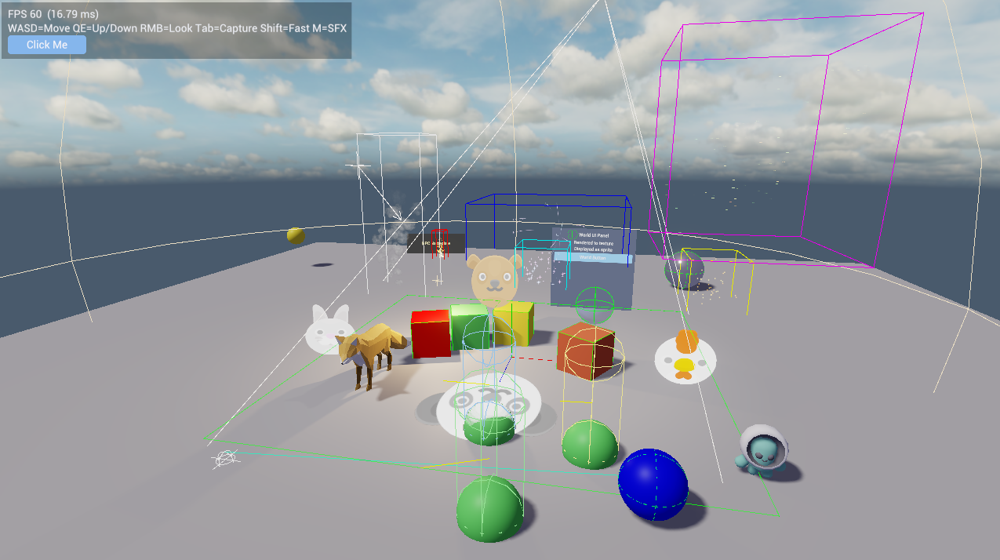

# Sedulous Engine

[](https://discord.gg/WSvxW8mWH5)
[](LICENSE)

A modular game engine written in [Beeflang](https://www.beeflang.org/) with a
cross-platform RHI (Vulkan + DX12), forward PBR renderer, entity-component
scene system, and an Android-inspired retained-mode UI framework.

> **Note:** Sedulous is under active development. APIs are subject to change.
> Previous iterations of the engine have been used to create a few games.
> This version is a significant evolution and a full game built on it is
> in progress.

## Architecture

Sedulous is built in layers. Each layer depends only on the layers below it.

```
Applications    -- Game, Editor, Sandboxes
Engine Layer    -- Engine.Core (Scene, Entities, Components, Transforms, Serialization)
                   Subsystems: Scene, Input, Physics, Animation, Audio, Navigation, Render, UI
Renderer Layer  -- RenderContext, Pipeline, PostProcessing, Shadows, Particles
Foundation      -- RHI, Shell, VG, Fonts, UI, Resources, Jobs, Shaders, Math
```

**Foundation** libraries are self-contained and can be used independently in tools,
sandboxes, and tests without the engine.

**Renderer** is scene-independent -- it receives flat render data and draws it.
Scene integration lives in the engine layer.

**Engine** provides Engine.Core (scene model, transforms, serialization) and
subsystems (physics, audio, rendering, etc.) managed by a Context that handles
lifecycle and update ordering. Subsystems that need resources receive them as
explicit constructor parameters.

**Applications** own presentation (swapchain, frame pacing, blit) and decide
what to render and where.

## Key Features

### Rendering
- Forward PBR with Cook-Torrance BRDF (directional, point, spot lights)
- Depth prepass with masked geometry support
- Mini G-buffer (normals + motion vectors) for future post-FX
- Compute skinning (72->48 byte vertex transform)
- Hierarchical shadow atlas (cascaded directional, point cubemap, spot)
- GPU-instanced sprites (3 orientation modes)
- Depth-reconstructed projected decals
- CPU particle system with billboard/trail rendering, sub-emitters, LOD
- Post-processing: bloom (5-level chain) + ACES tone mapping
- Debug draw (wire shapes, screen text, light gizmos)
- Per-scene Pipeline -- multiple scenes render independently

### RHI (Rendering Hardware Interface)
- WebGPU-inspired, lower-level API
- Vulkan and DX12 backends
- Validation wrapper for debugging
- Command encoder pattern (ICommandEncoder -> IRenderPassEncoder -> ICommandBuffer)
- Dependency-driven render graph with transient texture pool

### Scene System
- Entity-component with lightweight handles (index + generation)
- ComponentManager<T> pooling with deferred initialization
- Hierarchical transforms with dirty-flag propagation
- 8 update phases including parallel AsyncUpdate
- Scene serialization via ISerializableComponent

### Physics
- Jolt Physics integration (multi-threaded)
- RigidBodyComponent with full config (shapes, mass, friction)
- Contact events (added, persisted, removed)
- Raycasting with entity handle decoding

### Animation
- Skeletal animation (clip playback, animation graphs)
- Property animation with binder registry
- SkinnedMeshComponent decoupled from animation

### Audio
- SDL3 audio backend
- Volume categories (Master x SFX/Music)
- Spatial audio with listener/source components
- Music streaming, one-shot API

### Navigation
- Recast/Detour integration
- NavMesh building, crowd management, obstacle avoidance
- NavAgent and NavObstacle components

### UI Framework (Sedulous.UI)
- Android-inspired retained-mode: View/ViewGroup/RootView hierarchy
- MeasureSpec layout system
- Theme system with drawable-based skinning
- Input routing, focus management, drag-drop
- Animation, overlays, popups, dialogs
- Runs headless for tests -- no engine dependency

### UI Toolkit (Sedulous.UI.Toolkit)
- DockManager with floating OS windows
- SplitView, MenuBar, StatusBar, Toolbar
- PropertyGrid with transactional editing (BeginEdit/EndEdit for undo)
- TreeView, ColorPicker, TabView (closable)
- DraggableTreeView, IFloatingWindowHost

### Editor (Sedulous.Editor)
- Plugin-based architecture ([EditorPlugin] auto-discovery)
- Project management (.sedproj)
- Scene editor with hierarchy, 3D viewport, inspector
- Orbit/fly camera controller
- Per-page undo/redo command stack
- LogView with thread-safe log capture
- Multi-window docking with cross-window drag
- ViewportView with render-to-texture via external texture cache

## Application Models

### Runtime.Client.Application
Lightweight base for sandboxes, tools, and the editor. Owns Shell + RHI + SwapChain.
Virtual CreateLogger() for custom logging. EditorApplication extends this.

### EngineApplication
Full engine with automatic subsystem registration. Owns presentation pipeline
(clear -> RenderScene -> blit -> overlays -> present). Sedulous currently follows
a code-first development model -- game logic lives in components and subsystems.
Editor tooling for a visual workflow is work-in-progress.

**EngineSandbox** showcases this well and serves as the primary testbed for engine
features -- PBR rendering, shadows, skinned meshes, particles, sprites, decals,
debug draw, world-space UI, physics, audio, and navigation.



### EditorApplication
Extends Application directly. Owns UIContext/VGRenderer for editor UI. Creates
a RuntimeContext with engine subsystems for scene preview. Each scene page gets
its own dock tab with a viewport rendering via ISceneRenderer.

## Platform Support

Sedulous is developed and tested on Windows. The engine is intended to be
cross-platform, but targeting other platforms would require building the
dependencies for those platforms and filling any gaps in RHI bootstrapping.

## Known Limitations

- **DX12 renderer support**: The RHI layer and RHI samples work on both Vulkan and
  DX12. However, Sedulous.Renderer and its shaders have only been developed and tested
  with the Vulkan backend. Updating them for DX12 is straightforward but not a current
  priority.

## Requirements

- [Beeflang](https://www.beeflang.org/) (BeefBuild or Beef IDE)
- [Vulkan SDK](https://vulkan.lunarg.com/) (for shader compilation)
- Vulkan-capable GPU supporting Vulkan 1.3 or later

## Building

```
cd Code
BeefBuild -workspace=. -project=EngineSandbox     # Game sandbox
BeefBuild -workspace=. -project=Sedulous.Editor.App # Editor
BeefBuild -workspace=. -project=UISandbox          # UI demo
```

**Shader compilation note:** The first run of EngineSandbox may take a while as
all shaders are compiled on startup. To speed up subsequent runs, enable shader
caching in `Code/Engine/Sedulous.Engine.App/src/EngineAppSettings.bf`:

```beef
public bool EnableShaderCache = true;   // default is false
```

Shader caching is disabled by default because there is no automatic change
detection yet -- if you modify shaders, you must manually delete the cache
directory for them to recompile.

## Project Structure

```
Code/
  Foundation/          -- Core libraries (RHI, Shell, VG, UI, Physics, Audio, etc.)
  Engine/              -- Engine.Core (scene model) + subsystems (Input, Physics, Render, UI, etc.)
  Editor/              -- Editor core + application
  Samples/             -- EngineSandbox, UISandbox, RHI samples, etc.
  Deprecated/          -- Sedulous.GUI (replaced by Sedulous.UI stack)
  Dependencies/        -- Third-party bindings (Bulkan, SDL3, Jolt, Recast, etc.)

Documentation/
  Architecture.md      -- Full architecture reference
  Roadmap/             -- RendererRoadmap, EditorRoadmap, EngineRoadmap, UI.md
```

## Documentation

- [Architecture](Documentation/Architecture.md) -- Full architecture reference
- [Editor Roadmap](Documentation/Roadmap/EditorRoadmap.md) -- Editor implementation plan
- [Renderer Roadmap](Documentation/Roadmap/RendererRoadmap.md) -- Rendering feature plan
- [Engine Roadmap](Documentation/Roadmap/EngineRoadmap.md) -- Engine gap analysis
- [UI Plan](Documentation/Roadmap/UI.md) -- UI framework design and phase plan

## Contributing

See [CONTRIBUTING.md](CONTRIBUTING.md) for guidelines on setting up the project,
coding conventions, and submitting changes.

Areas where help is welcome:
- Testing and reporting issues
- Editor tooling
- Cross-platform support (Linux, macOS)
- Items on the roadmaps that are not yet complete

## Dependencies

Built on these Beeflang bindings:
- **Bulkan** -- Vulkan API
- **Win32-Beef** -- DirectX 12 / Win32 API
- **SDL3-Beef** -- Window, input, audio
- **joltc-Beef** -- Jolt Physics
- **recastnavigation-Beef** -- NavMesh / pathfinding
- **Dxc-Beef** -- HLSL shader compilation
- **stb_image-Beef**, **stb_truetype-Beef** -- Image loading, font rasterization
- **cgltf-Beef** -- glTF model loading

## Inspiration

Sedulous draws inspiration from [ezEngine](https://github.com/ezEngine/ezEngine),
[LumixEngine](https://github.com/nem0/LumixEngine) (mostly earlier iterations),
and [Traktor](https://github.com/apistol78/traktor).

## Community

Join the [Discord](https://discord.gg/WSvxW8mWH5) for discussion and support.
