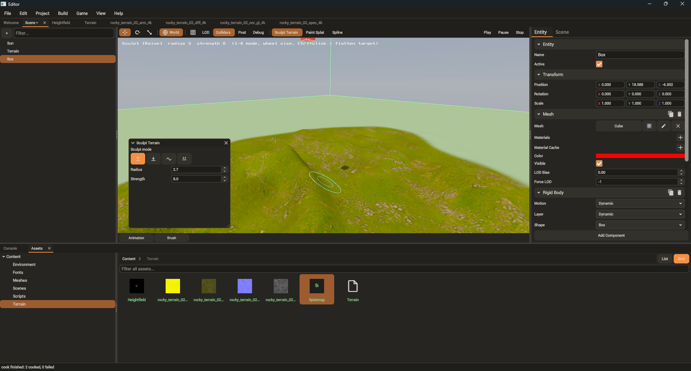

# Sedulous Engine

A game engine written in [Beef](https://www.beeflang.org/): a layered runtime with Vulkan,
Direct3D 12 and WebGPU backends, a scene editor, an asset pipeline, AngelScript gameplay
scripting, and a CSS styled UI framework. It runs on Linux, Windows and, through
emscripten, in the browser.

This is the second iteration of the engine. The previous one continues on the `v0` branch;
[Documentation/Changes.md](Documentation/Changes.md) shows what changed between the two.



## What is here

**Rendering.** A render graph over an abstract RHI: forward PBR with a depth prepass,
cascaded and local shadows, IBL and reflection probes, decals, sprites, particles, skinned
meshes, terrain, and a post stack with ambient occlusion, SSR, SSGI (experimental), bloom, TAA, MSAA,
auto exposure, grading and FXAA. Backends for Vulkan 1.3, D3D12 and WebGPU (wgpu-native on
the desktop, the browser's own in a wasm build). Shaders are HLSL, compiled through DXC and
cross compiled to WGSL for the web, and cooked into packs.

**Scene and engine.** Entities with hierarchical transforms, component managers per domain,
prefabs with overrides, scene serialization, and the subsystems a game needs: physics
(Jolt), navigation (Recast/Detour), audio (miniaudio, four fixed buses plus custom ones with
effect chains), animation (skeletal, graphs, property animation), particles, splines,
terrain, input maps, networking with state replication, and world space UI.

**Scripting.** Gameplay code is AngelScript over a generated binding of the engine's
`[Scriptable]` surface, with behaviours, coroutines and callbacks. See
[Documentation/Shipping/Scripting.md](Documentation/Shipping/Scripting.md).

**Editor.** Scene hierarchy, viewport with gizmos and per domain tools (terrain sculpting and
painting, spline editing), inspectors generated at compile time from the component types,
an asset browser over the import and cook pipeline, undo and redo, play in editor, and a
page per asset type: materials, meshes, textures, fonts, audio, animation clips and graphs,
particles, input maps, UI documents and themes, scripts.

**Pipeline.** Importers (glTF, FBX and OBJ, images, audio, fonts), cooks per asset type,
texture compression (BC7, ASTC), an export that packages a project for the desktop player
or the web, and headless tools for all of it.

**UI.** A retained view tree with flex, dock, grid and flow layouts, `.sml` markup and
`.sss` stylesheets with a cascade, transitions and themes, keyboard and gamepad navigation,
a vector graphics layer with SVG, distance field and coverage fonts, and an editor toolkit
(docking, property grids, colour pickers, curve and gradient editors, a node graph canvas).

**Agent tooling.** An MCP host (`Sedulous.Tools.Mcp`) exposes the engine's reflection, the
script API, and project operations (import, cook, scene validation, health checks) so an AI
agent can work on a project. The bundled skill under `.claude/` is the in checkout recipe.

## Building

Requirements:

- A recent [Beef nightly](https://nightly.beeflang.org/index.html), for BeefBuild and the IDE.
  Upstream is sufficient; the `working` branch of [our fork](https://github.com/jayrulez/Beef)
  carries the compiler fixes we have contributed that are still in review, none of which the
  engine depends on.
- Linux x64 or Windows x64. Prebuilt native libraries for both are in the tree under
  `Dependencies/*/dist`; each dependency has a `build-native.sh` / `build-native.ps1` to
  rebuild them.
- A Vulkan 1.3 or D3D12 capable GPU to run anything that draws.
- For web builds, [emsdk](https://emscripten.org/) on the path.

Everything is one Beef workspace under `Code/`:

```
cd Code
BeefBuild -project=Samples.HelloWindow          # the smallest sample
BeefBuild -project=Sedulous.Tools.Editor         # the editor
BeefBuild -project=Samples.Sandbox               # the engine sandbox
BeefBuild -test -project=Sedulous.Core.Tests     # one test project
```

Outputs land in `Code/build/<Config>_<Platform>/<Project>/`. Executables find the engine's
data by walking up to the `.dataroot` marker in `Data/`, so they run from the build
directory, the project directory or the repository root alike.

Running the editor:

```
Code/build/Debug_Linux64/Sedulous.Tools.Editor/Sedulous.Tools.Editor            # project manager
Code/build/Debug_Linux64/Sedulous.Tools.Editor/Sedulous.Tools.Editor <projectDir>  # open a project
```

## Repository layout

```
Code/
  Foundation/     Core, RHI and backends, Shell, Resource, VFS, Scene, Render, UI, VG,
                  Fonts, Audio, Physics, Navigation, Net, Script, Shaders, ...
  Engine/         The subsystems over Foundation, the default application, the player
  Pipeline/       Importers and cooks per asset type, the export
  Editor/         Editor core and one module per domain
  Tools/          Editor, Cook, Export, ShaderPack and Mcp executables
  Samples/        Engine samples and the 30 RHI samples
  Integration/    Cross collection flow tests
Data/             Engine data: shaders, fonts, themes, environments
Dependencies/     Beef bindings for the native libraries, with prebuilt binaries
Bin/              Naga and Tint, the WGSL tools the shader cook drives
Documentation/    Shipping documentation, served to agents through the MCP host
```

Each Foundation and Engine module has a sibling `.Tests` project; `Integration/` holds the
flows that cross collections. The samples under `Samples.RHI.*` exercise one backend feature
each, from a triangle to ray tracing and render bundles, and run on every backend.

## Platform support

Linux and Windows are the development platforms, on Vulkan and D3D12. WebGPU runs on the
desktop through wgpu-native and in the browser through a wasm build; `Samples.WebTriangle`
and `Samples.WebScene` are the browser samples, and the export tool produces a web player.
macOS has no backend yet.

## Dependencies

Beef bindings, vendored under `Dependencies/`: Bulkan (Vulkan), Win32-Beef (D3D12 and
DXGI), wgpu-Beef, SDL3, Dxc-Beef and SPIRV-Cross, joltc-Beef, recastnavigation-Beef,
miniaudio (with stb_vorbis for Ogg), AngelScript-Beef, cgltf and ufbx, meshoptimizer,
msdfgen, stb_image and stb_truetype, astcenc, bc7enc and bcdec, cimgui.

## License

MIT. See [LICENSE](LICENSE).
