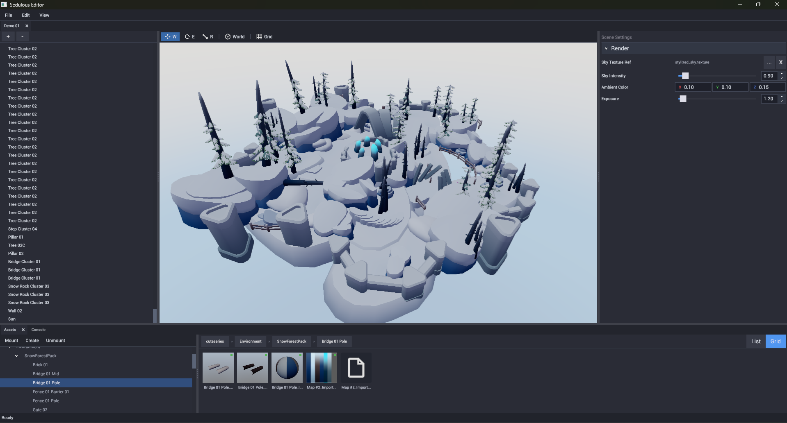
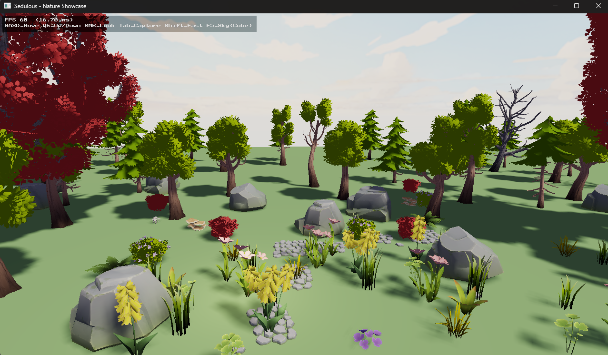
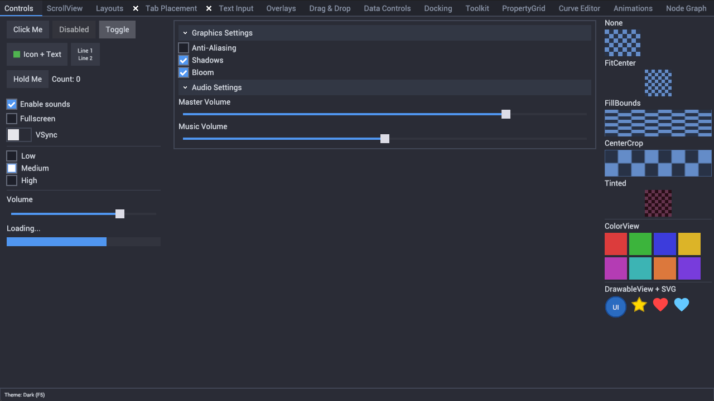

# Sedulous Engine

[](https://discord.gg/WSvxW8mWH5)
[](LICENSE)
[](https://sedulousworks.github.io/Docs/)

A game engine written in [Beeflang](https://www.beeflang.org/) with Vulkan and DX12 rendering, a scene editor, and a CSS-styled UI framework. Built for making 3D games.



## What You Get

**Renderer** -- Forward PBR with shadows, particles, decals, sprites, skeletal animation, IBL, reflection probes, and post-processing (SSAO, bloom, TAA, FXAA, tone mapping). Runs on Vulkan 1.3 or DX12.

**Scene System** -- Entity-component architecture with hierarchical transforms, prefab spawning, and scene serialization. Physics (Jolt), navigation (Recast/Detour), and audio (SDL3 with 3D spatialization, bus mixing, DSP effects) are built in.

**Editor** -- Scene hierarchy, 3D viewport with transform gizmos, inspector with auto-generated property editors, asset browser with import pipeline, undo/redo, GPU entity picking, multi-window docking.

**UI Framework** -- Build game menus, HUDs, and tools with declarative XML markup (`.sml`) and CSS-inspired stylesheets (`.sss`). Flex, dock, grid, and flow layouts. Buttons, sliders, lists, tabs, text input, and more. Gamepad navigation works out of the box. World-space billboard UI for health bars and labels attached to 3D objects.

**Editor Toolkit** -- Dockable panels, property grids, menu bars, split views, color pickers, node graph canvas, and draggable tree views for building editor tools.

> Sedulous is under active development. Previous iterations have shipped games;
> this version is a significant evolution with a game currently in progress.

## Getting Started

### Requirements

- [Beeflang Nightly](https://nightly.beeflang.org/index.html) (BeefBuild or Beef IDE)
- [Vulkan SDK](https://vulkan.lunarg.com/) (for shader compilation)
- GPU supporting Vulkan 1.3 or DX12

### Building

```
cd Code
BeefBuild -workspace=. -project=EngineSandbox      # Game sandbox
BeefBuild -workspace=. -project=Sedulous.Editor.App # Editor
BeefBuild -workspace=. -project=UISandbox           # UI demo
```

The first run compiles all shaders on startup, which takes a while. To cache them for faster subsequent runs, set `EnableShaderCache = true` in `Code/Engine/Sedulous.Engine.App/src/EngineAppSettings.bf`. If you modify shaders, delete the cache directory to force recompilation.

### Samples

**EngineSandbox** is the main testbed -- PBR rendering, shadows, skinned meshes, particles, sprites, decals, physics, audio, navigation, and world-space UI all in one scene.

**Showcase** demonstrates the asset import pipeline with a stylized nature scene built from glTF models.



**UISandbox** shows every UI control, layout, and styling feature -- buttons, sliders, checkboxes, lists, trees, tabs, drag-and-drop, docking, context menus, and .sml markup loading.



## Architecture

Sedulous is built in layers. Each layer depends only on the layers below it.

```
Applications    -- Games, Editor, Sandboxes
Engine          -- Scene, Entities, Components, Transforms, Serialization
                   Subsystems: Scene, Input, Physics, Animation, Audio, Navigation, Render, UI
Renderer        -- RenderContext, Pipeline, PostProcessing, Shadows, Particles, IBL
Foundation      -- RHI, Platform, VG, Fonts, UI, Resources, Jobs, Shaders, Math
```

**Foundation** libraries work standalone -- use them in tools and tests without the engine. **Renderer** is scene-independent; it takes flat render data and draws it. **Engine** provides the scene model and subsystems. **Applications** own the window and decide what to render.

## Project Structure

```
Code/
  Foundation/          -- Core libraries (RHI, Platform, VG, UI, Physics, Audio, etc.)
  Engine/              -- Engine.Core (scene model) + subsystems
  Editor/              -- Editor core + application
  Samples/             -- EngineSandbox, UISandbox, Showcase, RHI samples
  Tools/               -- Asset importers and utilities
Dependencies/          -- Third-party bindings

Assets/                -- Shaders, fonts, GUI themes, sample assets
Documentation/
  Manual/              -- Getting started, scene system, rendering, input, audio, etc.
  Roadmap/             -- Feature plans for renderer, editor, engine, UI
  UI.md                -- UI framework reference (controls, styling, markup, gamepad)
```

## Documentation

- [**Manual**](https://sedulousworks.github.io/Docs/) -- Getting started, tutorials, and guides
- [UI Framework Reference](Documentation/UI.md) -- Controls, .sml markup, .sss styling, gamepad navigation

## Platform Support

Developed and tested on Windows. The engine is designed to be cross-platform, but other platforms would need dependency builds and RHI bootstrapping work.

## Dependencies

Built on these Beeflang bindings:

- **Bulkan** -- Vulkan API
- **Win32-Beef** -- DirectX 12 / Win32 API
- **SDL3-Beef** -- Window, input, audio
- **joltc-Beef** -- Jolt Physics
- **recastnavigation-Beef** -- NavMesh / pathfinding
- **Dxc-Beef** -- HLSL shader compilation
- **stb_image-Beef**, **stb_truetype-Beef** -- Image loading, font rasterization
- **cgltf-Beef** -- glTF model loading
- **ufbx-Beef** -- FBX/OBJ model loading

## Contributing

See [CONTRIBUTING.md](CONTRIBUTING.md) for setup and conventions. Help is welcome with testing, editor tooling, cross-platform support, and roadmap items.

## Community

Join the [Discord](https://discord.gg/WSvxW8mWH5) for discussion and support.

## Inspiration

Sedulous draws inspiration from [ezEngine](https://github.com/ezEngine/ezEngine), [LumixEngine](https://github.com/nem0/LumixEngine), and [Traktor](https://github.com/apistol78/traktor).
