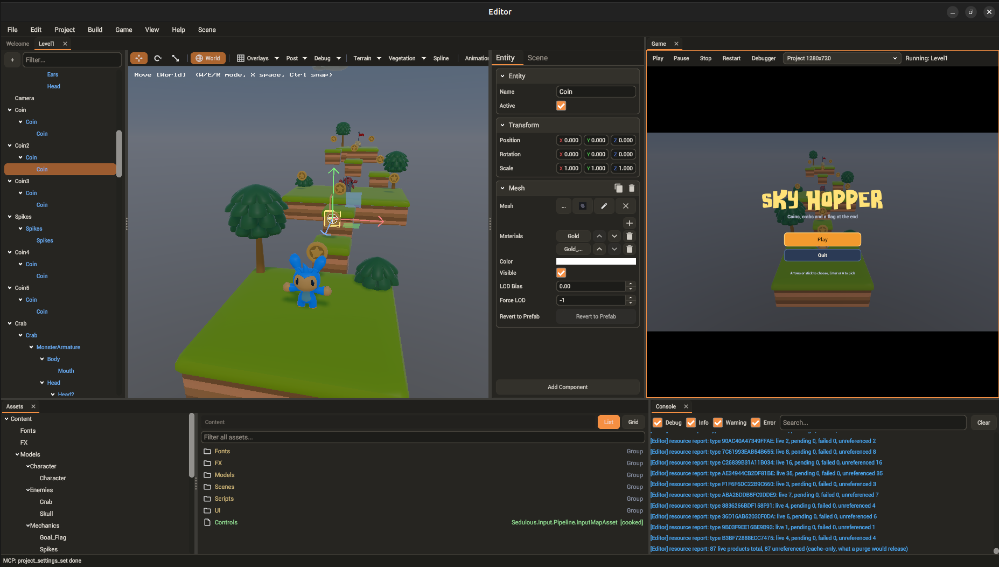
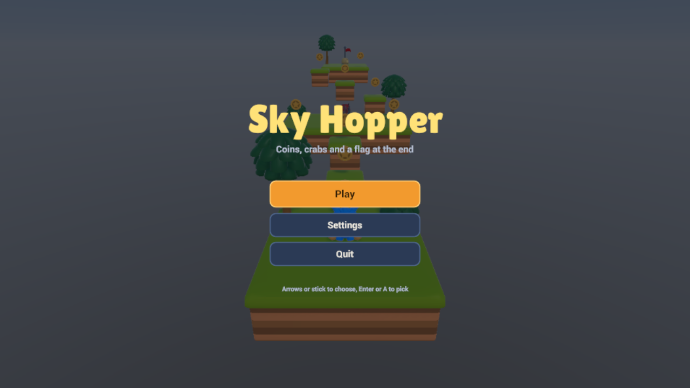
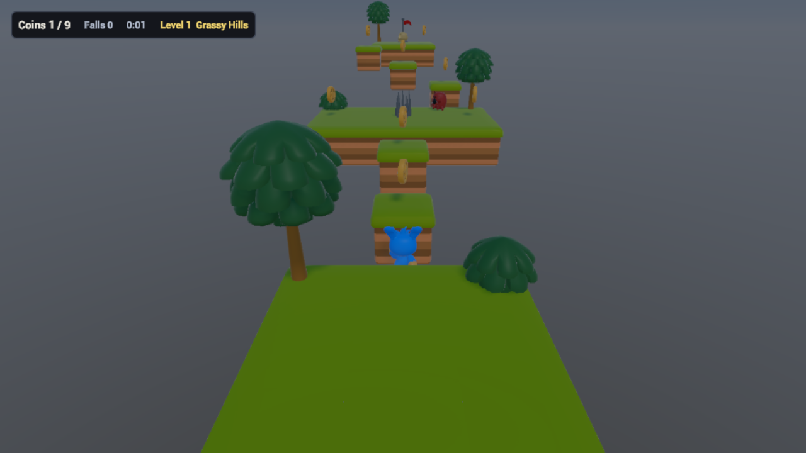
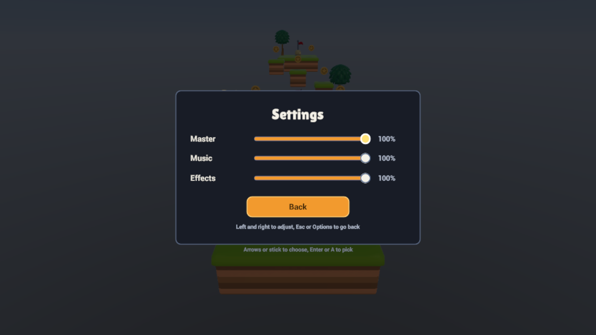
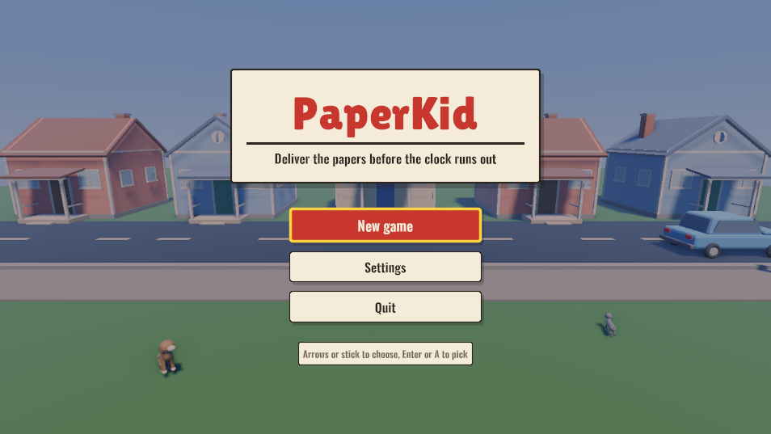
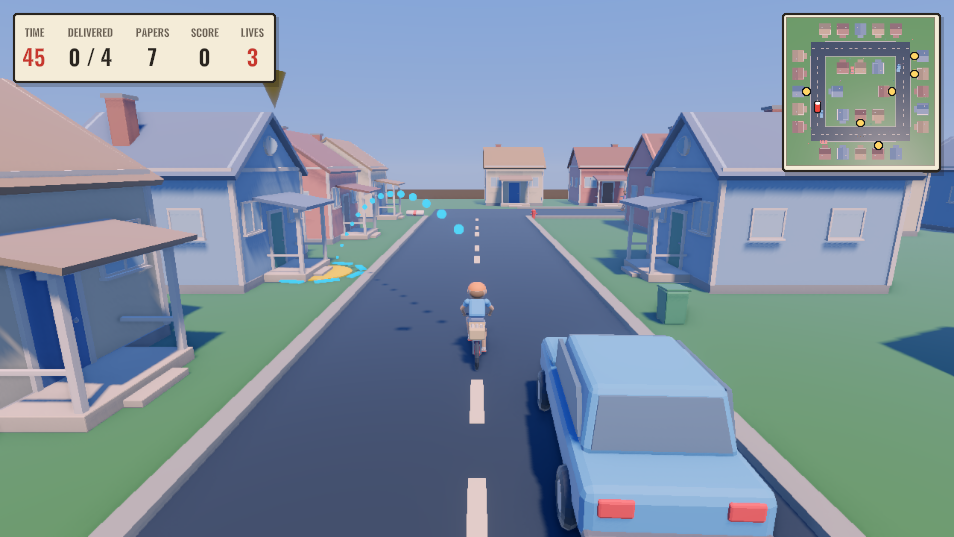
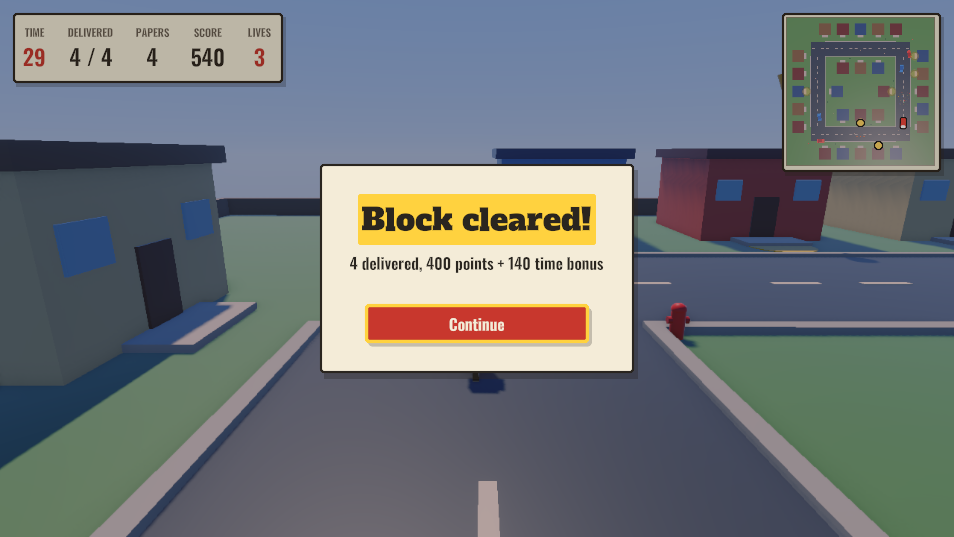

# Sedulous Engine

[](https://discord.gg/WSvxW8mWH5)
[](LICENSE)

A game engine written in [Beef](https://www.beeflang.org/), with the editor, asset pipeline and
tools to take a game from first scene to shipped build: a project made in the editor exports to a
desktop player, to the browser (WebGPU through emscripten) and to the Steam Deck. Underneath are a
layered runtime over an abstract RHI with Vulkan, Direct3D 12 and WebGPU backends; a render graph
driving forward PBR with shadows, image-based lighting and a full post stack; physics, navigation,
audio, skeletal animation with graphs and IK, terrain and vegetation; gameplay scripting in
AngelScript; and a CSS styled UI framework.

It is built to be worked by agents as well as people. An MCP host exposes the engine's reflection,
its script API, project operations and play in editor, and the three sample games in this
repository were each built and playtested through those tools, then shipped to the web
([SedulousDemos](https://sedulousworks.github.io/SedulousDemos/)).

This is the second iteration of the engine. The previous one continues on the `v0` branch;
[Documentation/Changes.md](Documentation/Changes.md) shows what changed between the two.



## What is here

**Rendering.** A render graph over the RHI: forward PBR with a depth prepass and clustered
lights; cascaded sun shadows and shadowed point and spot lights; image-based lighting and
reflection probes; decals, sprites, particles, skinned and instanced meshes, terrain and
vegetation; render textures for in-game cameras; and a post stack with ambient occlusion, SSR,
screen-space GI, bloom, TAA, MSAA, FXAA, auto exposure and colour grading. A game's look is set
once in shared environment and post profiles. Backends for Vulkan 1.3, D3D12 and WebGPU
(wgpu-native on the desktop, the browser's own in a wasm build). Shaders are HLSL, compiled
through DXC, cross compiled to WGSL for the web, and cooked into packs.

**Scene and engine.** Entities with hierarchical transforms, component managers per domain,
prefabs with overrides, scene serialization, and the subsystems a game needs: physics
(Jolt), navigation (Recast/Detour), audio (miniaudio, four fixed buses plus custom ones with
effect chains), animation (skeletal clips, animation graphs, IK, root motion, property
animation), particles, splines, terrain and vegetation, input maps, save data, networking with
state replication, and world space UI.

**Scripting.** Gameplay code is AngelScript over a generated binding of the engine's
`[Scriptable]` surface: behaviours per entity, a level script per scene, a game script per run,
coroutines and events, with a debugger in the editor. See
[Documentation/Shipping/Scripting.md](Documentation/Shipping/Scripting.md).

**Editor.** A project manager, scene hierarchy, a viewport with gizmos and per domain tools
(terrain sculpting and painting, vegetation, spline editing), inspectors generated at compile
time from the component types, an asset browser over the import and cook pipeline, undo and
redo, play in editor (several instances side by side), and a page per asset type: materials,
meshes, textures, fonts, audio, animation clips and graphs, particles, input maps, UI documents
and themes, render profiles, and scripts.

**Pipeline and shipping.** Importers (glTF, FBX and OBJ, images, audio, fonts), cooks per
asset type, texture compression (BC7, ASTC), and an export that packages a project for the
desktop player, the web or the Steam Deck from per target presets and player templates; headless
tools do all of it from the command line.

**UI.** A retained view tree with flex, dock, grid and flow layouts, `.sml` markup and
`.sss` stylesheets with a cascade, transitions and themes, keyboard and gamepad navigation,
a game UI kit (screen stacks, menus, bars, button prompts, toasts), a vector graphics layer
with SVG, distance field and coverage fonts, and an editor toolkit
(docking, property grids, colour pickers, curve and gradient editors, a node graph canvas).

**Agent tooling.** An MCP host (`Sedulous.Tools.Mcp`) exposes the engine's reflection, the
script API and project operations (import, cook, scene validation, export, health checks); the
editor serves the same tools over HTTP for its open project, plus its pages and play in editor,
where an agent plays the game with scripted input and reads back probes and screenshots.
[AGENTS.md](AGENTS.md) is how an agent works on the engine itself.

## Building

Requirements:

- A recent [Beef nightly](https://nightly.beeflang.org/index.html), for BeefBuild and the IDE.
  Upstream is sufficient; the `working` branch of [our fork](https://github.com/jayrulez/Beef)
  carries the compiler fixes we have contributed that are still in review, none of which the
  engine depends on.
- Linux x64 or Windows x64. Prebuilt native libraries for both are in the tree under
  `Dependencies/*/dist`, except SDL3 on Linux, which links the system's: install SDL 3.4
  (`libsdl3-dev` or your distribution's equivalent). The dependencies built from source carry a
  `build-native.sh` / `build-native.ps1` to rebuild them.
- A Vulkan 1.3 or D3D12 capable GPU to run anything that draws.
- For web builds, [emsdk](https://emscripten.org/) on the path.

Everything is one Beef workspace under `Code/`:

```
cd Code
BeefBuild -project=Samples.HelloWindow          # the smallest sample
BeefBuild -project=Sedulous.Tools.Editor         # the editor
BeefBuild -project=Samples.Sandbox               # the engine sandbox
BeefBuild -test -project=Sedulous.Core.Tests     # one test project
```

Outputs land in `Code/build/<Config>_<Platform>/<Project>/`. Executables find the engine's
data by walking up to the `.dataroot` marker in `Data/`, so they run from the build
directory, the project directory or the repository root alike.

Running the editor:

```
Code/build/Debug_Linux64/Sedulous.Tools.Editor/Sedulous.Tools.Editor            # project manager
Code/build/Debug_Linux64/Sedulous.Tools.Editor/Sedulous.Tools.Editor <projectDir>  # open a project
```

Add `--mcp` to serve the project to an agent over MCP while you work in the editor.

## Sample projects

Game projects under `Data/SampleProjects/`, opened from the editor's project manager. Each
was built entirely through the engine's MCP tools by an AI agent, its authoring scripts kept in
its `Tools/`, and each plays in the browser on
[SedulousDemos](https://sedulousworks.github.io/SedulousDemos/).

**Sky Hopper** (`PlatformerGame`) is a small 3D platformer, also shipped to a Steam Deck: five
floating islands, coins, enemies and hazards, menus with volume settings, music and effects,
and gamepad support throughout.

| Title | Level 1 | Settings |
|:---:|:---:|:---:|
|  |  |  |

**PaperKid** is an arcade paper-route game: five town blocks on a difficulty ramp, papers thrown with a soft auto-aim, traffic and pedestrians on
the navmesh, lives, a live minimap drawn by a top-down camera into a render texture, particle
effects, a newsprint UI theme, and music that speeds up when the clock runs low. The kid and
his bike, the houses, cars, people and animals are modelled, rigged and animated by Blender
scripts.

| Title | Riding a block | Block cleared |
|:---:|:---:|:---:|
|  |  |  |

**Snowline** is a snowboard time trial with tricks: three courses on generated terrain with vegetation, slalom gates, gems and kickers, spins and
grabs scored into combos, medal ghosts and your own best run alongside, and an avalanche on the
last course. The rider is driven through an animation graph by parameters, and the board leaves
decal tracks in the snow. Its rider, trees and props are modelled by Blender scripts.

## Repository layout

```
Code/
  Foundation/     Core, RHI and backends, Shell, Resource, VFS, Scene, Render, UI, VG,
                  Fonts, Audio, Physics, Navigation, Net, Script, Shaders, ...
  Engine/         The subsystems over Foundation, the default application, the player
  Pipeline/       Importers and cooks per asset type, the export
  Editor/         Editor core and one module per domain
  Tools/          Editor, Cook, Export, ShaderPack and Mcp executables; the Steam Deck build
  Samples/        Engine, web, UI and RHI samples (see Code/Samples/README.md)
  Integration/    Cross collection flow tests
Data/             Engine data (shaders, fonts, themes, environments) and the sample projects
Dependencies/     Beef bindings for the native libraries, with prebuilt binaries
Bin/              Naga and Tint, the WGSL tools the shader cook drives
Documentation/    Shipping documentation, served to agents through the MCP host
```

Each Foundation and Engine module has a sibling `.Tests` project; `Integration/` holds the
flows that cross collections. [Code/Samples/README.md](Code/Samples/README.md) describes every
sample.

## Platform support

Linux and Windows are the development platforms, on Vulkan and D3D12. WebGPU runs on the
desktop through wgpu-native and in the browser through a wasm build, which the export packages
a game for.
A Steam Deck player builds in a container (`Code/Tools/SteamDeck/`), and the export packages a
game for it. macOS has no backend yet.

## Dependencies

Beef bindings, vendored under `Dependencies/`: Bulkan (Vulkan), Win32-Beef (D3D12 and
DXGI), wgpu-Beef, SDL3, Dxc-Beef, joltc-Beef, recastnavigation-Beef,
miniaudio (with stb_vorbis for Ogg), AngelScript-Beef, cgltf and ufbx, meshoptimizer,
msdfgen, stb_image and stb_truetype, astcenc, bc7enc and bcdec, cimgui.

## Community

Join the [Discord](https://discord.gg/WSvxW8mWH5) for discussion and support.

## Inspiration

Sedulous draws inspiration from [ezEngine](https://github.com/ezEngine/ezEngine),
[LumixEngine](https://github.com/nem0/LumixEngine) and [Traktor](https://github.com/apistol78/traktor).

## License

MIT. See [LICENSE](LICENSE).
